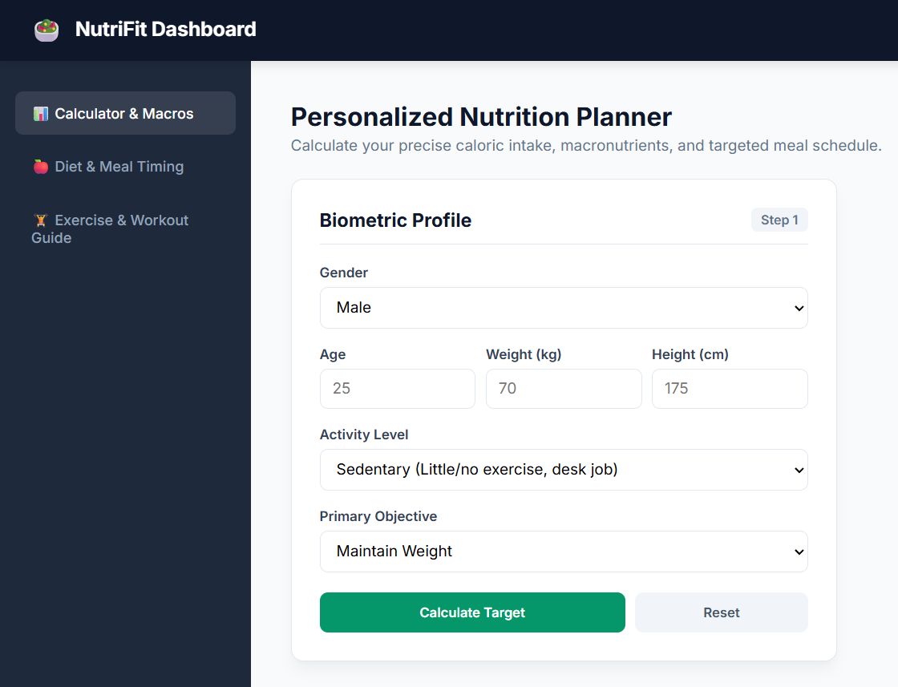
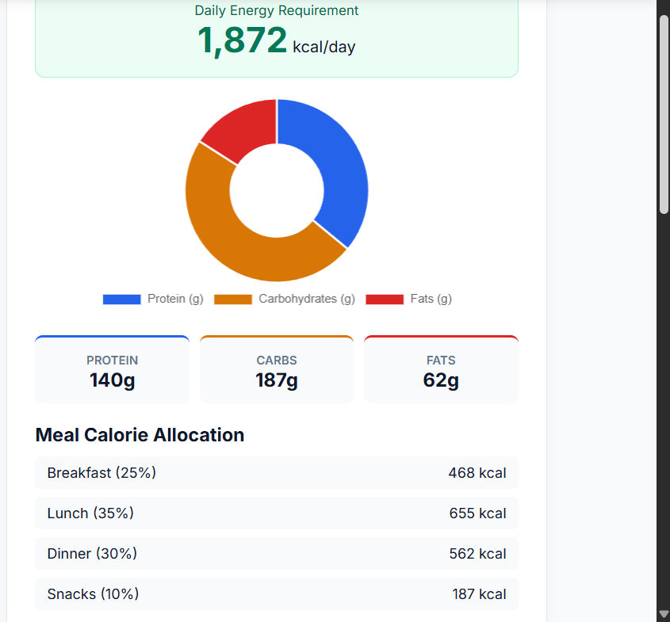
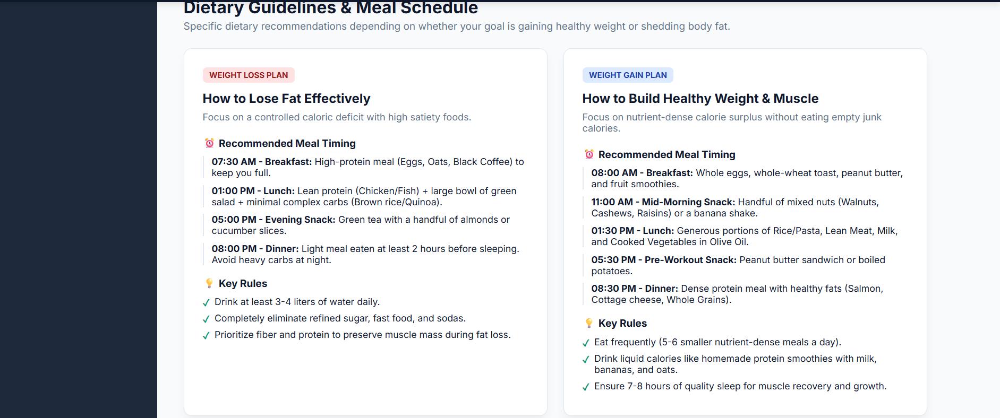
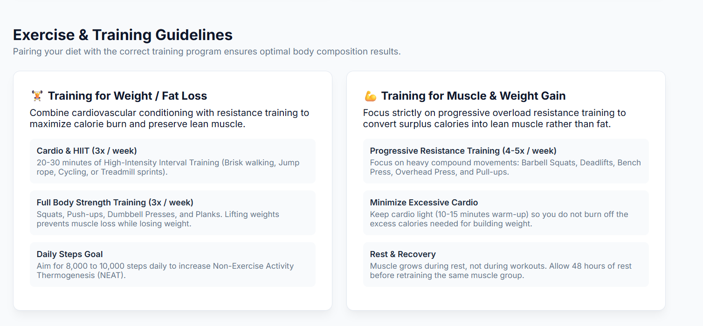

# Personalized Nutrition Planner

An interactive web application built with HTML, CSS, and JavaScript that calculates daily caloric needs (TDEE) and provides macronutrient budgeting tailored to user biometrics and fitness goals.

🌐 **Live Demo:** [Click Here to View App](https://nawsintabassum.github.io/Personalized-Nutrition-Planner/)

---

## Features

* **Precision Metabolic Calculation:** Calculates Basal Metabolic Rate (BMR) and Total Daily Energy Expenditure (TDEE) using the Mifflin-St Jeor formula.
* **Macronutrient Breakdown:** Displays Protein, Carbohydrates, and Fats with an interactive Chart.js visualization.
* **Meal Calorie Allocation:** Recommends target calorie distribution across Breakfast, Lunch, Dinner, and Snacks.
* **Dietary & Workout Guidelines:** Includes comprehensive meal timing schedules and exercise routines for both Weight Loss and Muscle Gain.
* **Local Data Persistence:** Saves biometric inputs in LocalStorage to retain user data across page reloads.

---

## How to use

1. Enter your biometric data (Gender, Age, Weight, Height, and Activity Level).
2. Select your primary goal (Maintain Weight, Weight Loss, or Weight/Muscle Gain).
3. Click **Calculate Target** to view your daily caloric requirements and macronutrient breakdown.
4. Navigate through the sidebar menu to explore meal schedules and targeted exercise routines.

---

## Dashboard Preview

---

## Files

* `index.html` - Core HTML structural layout and semantic sections
* `style.css` - Custom styling, CSS Grid, Flexbox, and dark/light UI themes
* `script.js` - Logic for BMR/TDEE calculations, LocalStorage, and Chart.js integration

---

## Author

**Nawsin Tabassum**